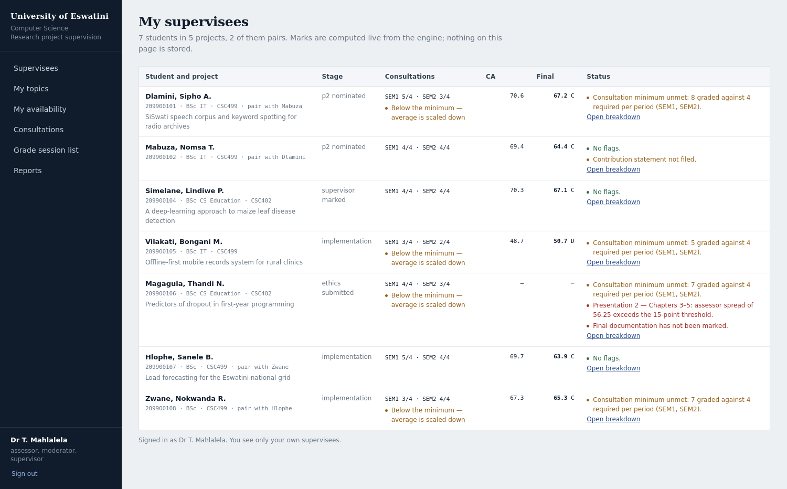
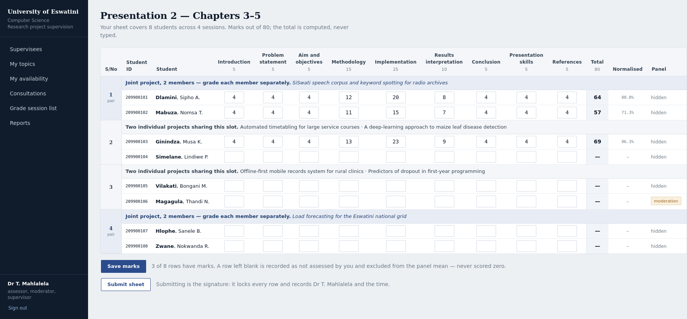

# UPSAS — Research Project Supervision & Assessment System

Department of Computer Science, University of Eswatini. Courses CSC 400 / 402 / 499.

Built to the brief in `docs/agent-brief.md`. This repository is the **assessment
core plus the deployment shell**, not the finished application. Read
"What is built" before planning around it.

---

## Running it

See [RUNNING.md](RUNNING.md) for local setup in VS Code.

## What is built and verified

| Area | State |
|---|---|
| Assessment engine | Complete, 19 passing tests, both policy fixtures exact |
| Security primitives | Password policy, audit hash chain, RBAC with separation of duty — 10 passing tests |
| Database schema | Complete Prisma schema, 30 models covering the whole domain |
| Rubrics | P1 (40) and P2 (80) transcribed verbatim, now versioned and editable by the coordinator — 14 passing tests; consultation and documentation seeded PROVISIONAL |
| Docker stack | Multi-stage build, compose with Postgres and local ClamAV, internal network |
| Screens | Three rendered reference designs plus eleven application screenshots in `mockups/` |
| Interface | Responsive to 360px, WCAG AA contrast, dark mode, print stylesheet, keyboard grading |
| Application | Ten working screens across student, supervisor and coordinator roles |

```
npm install
npm test          # 29 tests, all green
npm run typecheck # strict, noUncheckedIndexedAccess, exactOptionalPropertyTypes
npx tsx prisma/seed.ts   # verifies every rubric's criteria sum to its declared max
```

Docker:

```
cp .env.example .env      # fill POSTGRES_PASSWORD, SESSION_SECRET, TOTP_ENC_KEY
docker compose up --build
```

---

## The part that matters most

`src/lib/assessment/` is the heart of the system and was written test-first, as
the brief requires, before any UI work. Three rules are enforced there rather
than left to convention:

**Normalisation.** P1 is out of 40, P2 out of 80, documentation out of 100. Every
score persists its raw total *and* the rubric maximum in force when awarded.
`normalisePercentage()` is the only way a raw total becomes a percentage, and it
throws on an out-of-range score or a zero maximum. Code that averages raw totals
is a defect, and `tests/engine.test.ts` asserts 29/40 and 58/80 are the same
performance.

**Blanks are not zeros.** An assessor who leaves a student's row blank was absent
for that session. The row is excluded from the panel mean. Counting it as zero
would silently destroy a student's mark, so there is a test for it.

**Two policy profiles, one engine.** The departmental 2022 guidelines and the
incoming policy disagree about how CA is composed. Both are expressed as
configuration, and the same inputs produce 67.1 under Profile A and 69.4 under
Profile B. Neither is hardcoded and the agent did not pick a winner — that is a
departmental decision, recorded in `docs/agent-brief.md` §14.

## Configuration invariants

`validateConfig()` refuses to let a department publish an impossible scheme:
CA sub-components must sum to the CA weight, CA and documentation must total
100, a consultation component cannot be weighted under `GATE_ONLY`, and a
consultation that carries neither weight nor gate is rejected as having no effect.

## Security posture

Authentication is local by policy. There is no federated identity table in the
schema and no `OAUTH_*`, `SSO_*`, `LDAP_*` or breach-API variable in
`.env.example` — the omissions are deliberate and documented there.

- Passwords follow **NIST SP 800-63B-4** (final, July 2025), which supersedes the
  2017 guidance most codebases still encode: length over composition, no forced
  rotation, screening against a **locally shipped** blocklist rather than a
  breach-check API.
- MFA is offline TOTP with locally generated secrets. No SMS, no push.
- Virus scanning is ClamAV inside the compose stack.
- The audit log is append-only and hash-chained; `verifyChain()` detects both
  alteration and deletion, and there is a test for each.
- RBAC is deny-by-default with explicit separation of duty. This matters here
  specifically because departmental staff hold several roles at once — the same
  lecturer supervises, assesses and moderates. Role checks alone would let
  someone moderate their own mark.

Every core flow is designed to work on an isolated network. Hosting in-country is
also the straightforward compliance path under the Eswatini Data Protection Act
41 of 2022, which restricts transfers outside SADC to jurisdictions with an
adequacy finding.

## A note on the demo data

The departmental forms carry real student names and numbers. None are reproduced
in this repository. Everyone in the seed data and the screens is fictional,
because seed data ends up in repositories, fixtures and screenshots, and that is
personal data under the Act.

---

## Screens




`mockups/` holds the rendered reference designs alongside screenshots of the running
application. The three reference designs are HTML, so they open in any browser and can
be marked up directly.

- `01-cohort-grading` — the assessor's session list. One sheet per assessor
  covering the whole cohort, mirroring the paper form: session numbers in the
  gutter, criteria with their maxima in the header, computed totals the assessor
  never types. Per-row save state including an offline queue, and a blank row
  shown explicitly as excluded rather than zero.
- `02-mark-breakdown` — the audit view of a computed mark, showing the working
  line by line, the full panel including the excluded blank sheet, and the
  provenance of the snapshot.
- `03-supervisor-dashboard` — supervisees with consultation counts against the
  requirement and the risk flags that follow from them.

## What to build next, in order

1. Next.js App Router shell, session handling and the RBAC middleware over
   `src/lib/rbac/policy.ts`.
2. The cohort grid grading screen, including offline draft persistence. This is
   the highest-risk UI in the system and the one most likely to be got wrong.
3. Topic catalogue, allocation and the e-signed agreement.
4. Consultation calendar, dual attestation and the register PDF.
5. Nomination, scheduling, moderation queue.
6. Documentation marking, publication workflow, PDF/A exports.

## Blocked on the department

Two rubrics are structural placeholders and are flagged `PROVISIONAL` in the seed
data. Neither should reach production unreviewed.

- **Consultation rubric.** Current practice records attendance only, with no
  marks, so this instrument does not yet exist. Profile A cannot be defended
  without it.
- **Final documentation marking guide.** Referenced in §B of the 2022 guidelines
  but not supplied. Blocks the final 60%.

Grade bands are also provisional pending the official UNESWA scheme.

## Group projects in the interface

Pairs are the norm, not the exception, so the screens treat them explicitly:

- **The session number is not the team.** The paper form's S/No column groups two
  students per slot, but that can mean one joint project or two unrelated students
  sharing a time slot. The grading grid bands each session and says which it is,
  because an assessor needs to know whether they are watching one presentation or
  two before they start marking.
- **Marks stay individual.** Members of a pair have their own rows and can be
  scored differently; the grid shows two pairs where the members diverge.
- **Consultations are always individual**, even on a joint project — the
  supervisor dashboard shows one member meeting the minimum while the other is
  scaled down for missing it.
- **Shared versus personal** is explicit on the mark breakdown: the proposal,
  artefact and documentation belong to the project; consultations, contribution
  statements and marks belong to the student.

The schema already models this correctly — `Consultation`, `AssessorSheet`,
`DocumentationMark` and `MarkSnapshot` all key on `ProjectMember`, never on
`Project` — so no data-model change was needed for any of the above.

## Reports and exports

`src/lib/reports/` holds a catalogue of 14 report definitions and two working
generators, with 16 tests. Three rules hold for every report:

**Reports read snapshots, they never recompute.** A mark schedule and the mark a
student sees come from the same stored number, so they cannot drift apart. This
is the single most common way an assessment system loses a dispute.

**Provenance travels beside the file, not inside it.** A schedule gets imported
into other systems, so the CSV stays pure data — comment lines would break the
import. A companion manifest records who pulled it, over what scope, from which
snapshots and config version, with a SHA-256 of the exact bytes issued. Generation
is deterministic, so that hash is checkable against a filed copy.

**Reports that may not carry provisional marks refuse to.** `buildManifest()`
throws rather than emit a student mark sheet containing an unpublished figure;
where provisional figures are permitted, the manifest carries a watermark.

Scope is part of the definition, not an afterthought: a student sees their own
mark sheet and their subject access export and nothing else, a supervisor sees
their own supervisees' register, an external examiner sees an assigned cohort.
Every extraction is an audit event, because exports move personal data out of the
system and that is what the Data Protection Act 41 of 2022 expects a controller to
be able to account for.

### Samples in `samples/`

Generated by `npx tsx samples/generate.ts` from genuinely computed snapshots — no
figure in these files was typed in.

- `mark-schedule-2025-2026.csv` — 8 students including one blocked for unmarked
  documentation and one flagged for an unmet consultation minimum
- `mark-schedule-2025-2026.manifest.json` — provenance and content hash
- `consultation-register-mahlalela.csv` — 60 sessions with both attestations,
  including a no-show that is shown but does not count
- `student-mark-sheet-209900101.pdf` — the appeal document

Still to build: XLSX output, the PDF/A conversion step, and the remaining twelve
generators. The catalogue defines them; only two are implemented.

## Login, roles and permissions

`src/lib/auth/` implements the identity decision end to end, with 22 tests.
Authentication is local, so there is no external verifier to defer to and every
gate is enforced here.

**Roles are resolved per request, not minted into a token.** The session record
holds a user id and nothing about what that user may do. `principalFromSession()`
rebuilds roles and permissions from live grants on every authenticated request,
so revoking a supervisor's grant takes effect immediately rather than at their
next sign-in. There is a test asserting exactly that.

**Grants are cycle-scoped.** A supervisor role for 2024/2025 does not carry into
2025/2026. Roles that are inherently cycle-bound cannot be granted globally at
all; only `ADMINISTRATOR` may be. An external examiner's grant carries a
`validUntil` and closes itself.

**Permissions are derived, never maintained.** `permissionsFor()` inverts the
action matrix in `src/lib/rbac/policy.ts`, so the list of what a role may do and
the check that enforces it cannot drift apart. Holding several roles unions their
permissions and nothing more — and separation of duty still applies per action,
which is why a lecturer holding `SUPERVISOR` and `MODERATOR` still cannot
moderate their own mark.

**Login gates, in order.** Lockout is checked before the password, because a
locked account should not be a password oracle. Account status is checked *after*
the password verifies, so the response never tells someone who lacks the password
whether an account exists or what state it is in. An unknown username and a wrong
password return the identical outcome shape.

**MFA is enforced at the role, not the user.** A coordinator or administrator
must pass an offline TOTP challenge. If they hold a privileged role but have not
enrolled, they are sent to enrolment rather than let through — and a privileged
role granted *during* an open non-MFA session cannot be exercised until they sign
in again with a second factor.

Every outcome, success and failure, is written to the audit chain.

Still to build: the TOTP verification endpoint itself, the HTTP middleware that
calls `checkSession` then `principalFromSession`, and the approval UI where a
coordinator activates a staff account and assigns its roles.


## The application

Eleven screens, all server-rendered and all working without JavaScript. Server-action
forms degrade to ordinary POSTs and the navigation opens with a checkbox rather than a
script, which matters on the connections this will run on. JavaScript, where present,
only adds convenience on top of a page that already works.

| Route | What it does |
|---|---|
| `/register` | Staff and student self-registration; staff accounts wait for coordinator approval |
| `/recover` | Redeem a coordinator-issued reset code and set a new password |
| `/cohort` | Enrolment status, the deadline schedule, extensions and accommodations, and account recovery |
| `/rubrics` | The coordinator edits the columns of a marking sheet: headings, marks, order, additions and removals, with a mandatory impact review |
| `/login` | Local password sign-in. Roles resolve per cycle; `coordinator` is challenged for a second factor |
| `/` | Supervisees or whole cohort by role, with pairs, consultation counts and live marks |
| `/consultations` | The register: grade a session, attest it, add one, see the component arithmetic |
| `/grading/p2` | The assessor's cohort sheet — the screen this system lives or dies on |
| `/marks/<student number>` | Full working, panel composition, provenance, and the Profile A/B comparison |
| `/reports` | Catalogue scoped to your roles, with working CSV downloads |
| `/me` | The student's view: their register, where their consultation mark stands, and their result once released |
| `/publish` | Coordinator moderation queue and result release |
| `/topics` | Supervisors publish or paste a list of topics and accept student proposals; students browse the pool, rank three and propose their own |
| `/book` | Students book open slots with their own supervisor; supervisors publish availability and see who booked |

Data lives in `src/lib/data/store.ts`, an in-memory stand-in for PostgreSQL. Every
read and write goes through a function there, so swapping in Prisma is a change to
that module and nothing above it. State resets when the server restarts.

### What is enforced, not just displayed

- Saving a mark re-checks authorisation **per student**, not once at page render. Posting a
  student who is not on your session list is refused by the server.
- A mark above a criterion's maximum is rejected with the criterion named.
- A submitted sheet is locked; only a coordinator can reopen it.
- `/api/reports/mark-schedule` returns 403 to a supervisor and 200 to a coordinator.
  The consultation register returns each supervisor only their own students.
- Rows left blank stay blank — never zero — and the mark breakdown shows them as excluded.
- Students attest their own sessions and no one else's: posting another student's session id is refused.
- A moderation with a one-word rationale is rejected. Moderating requires a sentence, recorded against your name.
- Separation of duty holds at release: whoever marked a component cannot release it, and a blocked mark cannot be released at all.
- A student sees a mark only after release. Marks in progress are not shown, because they can still change.
- Booking enforces 24 hours' notice, one session per day, and your own supervisor only.
- A slot already taken is refused rather than double-booked.
- Ranking three topics rejects duplicates. Ranking is not allocation, and the screen says so.
- A student proposal goes to the named supervisor, who cannot accept it while at capacity.
- Bulk topic upload counts the lines it skipped rather than guessing at them.

### Known gaps

The allocation run itself is not built: students rank and propose, supervisors publish
and accept, but no screen yet turns preferences into projects — a coordinator would still
do it by hand. The e-signed agreement, presentation nomination and scheduling,
documentation marking in the UI, deliverable upload, TOTP verification and PDF/A export
are specified but not built.


## Interface conventions

The stylesheet is the design system: every colour, radius and shadow is a token in
`src/app/globals.css`, and nothing is styled by a framework. Four rules hold across
the screens.

**Nothing scrolls sideways except the thing that should.** Dense sheets live inside
`.table-wrap`, so a thirteen-column grading grid scrolls within its own box while the
rail and headings stay put. Below 900px the student column pins to the left edge, since
a mark typed against the wrong name is the failure mode that matters.

**The shell works without JavaScript.** The navigation collapses on a narrow screen
through a checkbox and a label, not a script. Identity and sign-out stay reachable at
every width.

**Colour carries meaning and meets AA.** Body and secondary text clear 4.5:1 on both
canvas and surface, field borders clear 3:1 against adjacent fills, and the dark scheme
is a second set of token values rather than a second stylesheet. `prefers-reduced-motion`
is honoured.

**Every input has a name a screen reader can use.** Mark fields are labelled with the
student, the criterion and its maximum, rejected cells carry `aria-invalid`, and the
grading sheet has a caption explaining that a blank cell is an absence, not a zero.

On the grading sheet specifically: Enter and the arrow keys move down a column because
marking runs down a criterion rather than across a student; the save control follows the
assessor down the sheet; every rejected mark is listed rather than only the first; and
leaving with unsaved marks warns first. `@media print` strips the furniture and adds the
assessor and date, because these sheets get filed on paper.


## Changing an assessment form

The columns of a marking sheet are the department's instrument, not presentation,
and they change between cycles. `/rubrics` lets the coordinator change them —
rename a heading, move a column, alter what it is worth, add one, retire one —
without a code change. `config.edit` is the permission, so it is coordinators and
administrators only.

What makes this safe rather than merely flexible is that a mark means nothing apart
from the form it was awarded under. Four rules enforce that, and each exists because
breaking it corrupts a mark silently rather than failing loudly.

**A used form is never rewritten.** If nothing has been marked against the current
version it is still a draft instrument and edits apply in place. The moment a mark
exists, an edit publishes a new version instead. Sheets already signed stay attached
to the version they were signed under, for ever; open sheets move to the new one.

**A column's id is permanent.** Renaming "Implementation" to "Artefact and
demonstration" keeps `c5`, so every mark already keyed to `c5` survives the rename.
A retired id is never reissued, so a new column cannot inherit a departed one's marks.

**The sheet maximum is the sum of its columns.** It is computed on save and nowhere
typed, which is what keeps `normalisePercentage()` honest and the seed's
sum-to-maximum check true by construction.

**Lowering a column below a mark already awarded blanks it.** Truncating 12 to 10
would overwrite an assessor's judgement with an invented one. The row goes blank
instead — excluded from the panel mean, not scored zero — and the assessor is asked
for it again.

Nothing is written until the coordinator has seen the consequences. Saving produces a
review first: which columns change, what the total becomes, how many sheets move,
which marks get blanked and whose they are, and which students would end up assessed
on two different forms because one assessor has signed and another has not. That last
one is arithmetically fine — every score normalises against its own maximum — but
whether a panel may span two instruments is an academic decision, so it is put in
front of a person rather than made quietly. A reason for the change is required and is
kept with the version, alongside who made it and when.

`src/lib/rubrics/instrument.ts` holds the decision logic and touches no storage, so
the rules above are tested directly in `tests/rubrics.test.ts`.


## Students who are not on the ordinary path

The assessment engine used to assume every student starts in September, sits both
presentations and submits documentation. Real cohorts contain deferrals,
withdrawals, supplementary sittings and students repeating the project while
carrying a component they already passed. `src/lib/enrolment/status.ts` models
the five states and answers the two questions that matter: is this student
assessed this cycle, and which components are already credited.

The consequences reach into three places. `sessionsFor()` drops a deferred or
withdrawn student from every session list, so no route can schedule or mark
someone who is not being assessed. `computeFinalMark()` returns a snapshot saying
`NOT_ASSESSED_THIS_CYCLE` rather than a shelf of pending flags that would read as
a department behind on its marking. And a carried component stands in for its
panel, recorded with the cycle and board decision that credited it.

Credit carries as a percentage, never a raw total, because the earlier cycle's
form may have had a different maximum. That is the same rule that governs
`normalisePercentage()` applied across cycles rather than across rubrics.

## Deadlines, extensions and accommodations

Every date in this programme previously lived in a Word document, which meant
lateness was decided by whoever read it last. The coordinator now holds the
schedule in `/cohort`, students see their own dates on `/me`, and two rules apply.

An extension only ever moves a deadline later. To bring one forward, the deadline
changes for everyone. Grace absorbs the student submitting at 23:59 on a slow
connection; it is not a second deadline and students are not shown it.

The grounds for an accommodation are not the supervisor's business. A supervisor
sees that a student's date differs; only a holder of `config.edit` sees why.
Disability and medical grounds are the data the Act treats most carefully, and
the interface is where that is honoured or lost.

## Account recovery

Sign-in is local by policy, so there is no external account to recover through.
The alternative departments fall into is the coordinator typing a new password
and reading it down the phone, which leaves the coordinator holding a password
that is then used to sign as that person.

Instead the coordinator issues a code. It is nine characters from an alphabet
with no `0`, `O`, `1`, `I` or `L`, because it gets read aloud and written down.
Only its SHA-256 is stored. It expires in thirty minutes, works once, and
issuing a new one cancels any outstanding code. The person sets their own
password at `/recover`, and redeeming ends every session that account holds —
a forgotten password and a stolen one are indistinguishable from the system's
side, so the safe assumption is that somebody else may be signed in.

Every failure returns the same sentence. Distinguishing "no such code" from
"expired" tells someone working through codes which guesses were close, and a
legitimate user gains nothing from the difference that asking again does not
also solve.

Verifying that the person on the phone is who they say remains a procedure, not
code, and it is the part the department has to get right.

## Meeting emails

Every meeting event that rings the bell is also emailed, to both people, from
the same event, so the inbox and the screen always say the same thing. A booking
reaches the supervisor with a **Confirm or decline** button; a confirmation,
decline or cancellation reaches both sides. A reply goes to the other person in
the meeting rather than to a no-reply address. The button opens the exact row
where the meeting can be acted on, signing the reader in first if necessary.

Mail is sent through [Resend](https://resend.com). Set in `.env`:

| Variable | Purpose |
|---|---|
| `RESEND_API_KEY` | Empty means emails are written to the server log instead of sent |
| `RESEND_FROM` | The sender. `onboarding@resend.dev` only delivers to the Resend account owner's own address; verify a domain in Resend to reach students and staff |
| `EMAIL_REDIRECT_TO` | Testing: send everything to one inbox, subject prefixed with the intended recipient |
| `APP_URL` | Public address of the deployment, used for links in emails |

Only people with an address on file are emailed. Students give one at
registration; a coordinator can set or correct anyone's under
**Cohort register → Account access**. Sending never blocks a booking: if Resend
is slow or refuses, the booking stands and the bell still rings.

Sign-in, recovery and MFA remain entirely local. Resend carries outbound
notifications only.
